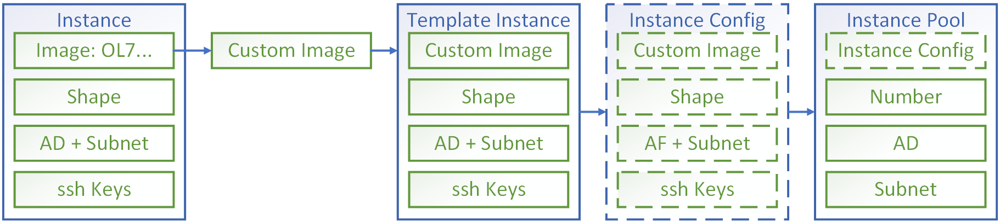

## Welcome to Oracle Cloud Infrastructure Scaling workshop!

### Thanks for joining!

You may ask questions on lab as well as Oracle Cloud Services to **Andrey Nepomnyaschiy**, Senior Solution Engineer at Oracle Digital.


### Before you begin

Useful links:

- [About Oracle Cloud Infrastructure](https://www.oracle.com/cloud/)
- [Oracle Cloud Free Trial](https://www.oracle.com/cloud/free/)
- [Always Free Services](https://www.oracle.com/cloud/free/?source=:ow:o:p:nav:0916BCButton&intcmp=:ow:o:p:nav:0916BCButton#always-free)

You will need basic understanding of Linux command line, ssh and cloud services concept.

In order to run this workshop, you will need an access to Oracle Cloud Infrastructure. If you don't have an account, [please subscribe to a free trial](ft.md).

Please check out [free **training** and **certification** opportunities](https://www.oracle.com/corporate/blog/free-certifications-oracle-oci-autonomous-033020.html) available from Oracle till **May 15, 2020**.

### 1. Preparation

#### 1.1. Connect to Oracle Cloud Infrastructure

You can use any modern browser. We recommend to turn off all extensions that may affect browsing (such as ad blockers).

Open https://oracle.com, press **View Accounts**, and then **Sign in to Cloud** 

Enter your account name (which you have specified during account creation) and press **Next**.

Account name is also shown in the email with initial password which you have received upon account creation.

Enter your username (usually email) and password.

Oracle Cloud Dashboard will be open.

Here you can check your account balance, summary of your services and other useful information.

Press **Infrastructure** button to enter Infrastructure section. You might need to enter cloud account name once again and press **Next**.

Also you can use direct link to infrastructure console (for **Frankfurt** region): https://console.eu-frankfurt-1.oraclecloud.com/a/compute/instances

#### 1.2. Create VCN

Go to **Networking / Virtual Cloud Network**

Press **Start VCN Wizard** button.

Choose **VCN with Internet Connectivity** and press **Start VCN Wizard**.

Enter VCN Name (for example: **vcn-workshop**)

You may leave other parameters unchanged.

Press **Next** and then press **Create**.

VCN with all necessary resources, including Public and Private subnets, will be created.

#### 1.3. Generate ssh keys
[How to create ssh keys](ssh.md) with `putty`

We can use Cloud Shell instead of `putty`.

Open Cloud Shell

Run command: `ssh-keygen`

View and copy ssh public key: `cat $HOME/.ssh/id_rsa.pub`


### 2. Create VM for Wordpress

Link: How to create a VM

Go to **Compute / Instances**.

Press **Create Instance**.

Enter instance name (for example: **ws-wordpress**)

Recommended parameters: OS Image: Oracle Linux, 1 OCPU, Public subnet. Make sure that **Assign a Public IP Address** item is selected.

Scroll down and select **Paste SSH Keys**.

Paste your public ssh key which you copied in 1.3.

Press **Create** to start creating VM.

After VM is created, you can connect to it from Cloud Shell with `opc` username: `ssh opc@<Public IP of your VM>` (insert Public IP address of your VM).

You will see a command prompt from your VM:

`[opc@ws-wordpress ~]$`

Enter command to update packages: `sudo yum update -y`

#### 2.1. Create File Storage Service

Go to **File Storage**.

Press **Create File System**.

In **File System Information** press **Edit Details** and enter File System name: `wordpress`

Choose the same Availability Domain where your VM is placed.

Scroll down to **Mount Target Information** and press **Edit Details**.

Enter New Mount Target name: `wordpress`

Choose **Private Subnet** in **Subnet**.

Press **Create**.

File system, Export and Mount Target will be created.

Go to **Exports** item of your created File System. Press 3-dots menu on the right side of Export, and check **Mount Commands**. You will need an IP address of your Mount Target.

You can also check it in **File Storage / Mount Tagrets / Mount Target Details**.

#### 2.2. Open FSS ports

We need to open ports for NFS:

- **Ingress** for **TCP** ports 111, 2048, 2049, and 2050, and **UDP** ports 111 and 2048.
- **Egress** for **TCP** source ports 111, 2048, 2049, and 2050, and **UDP** source port 111.

Usually Egress is already open for all protocols and all ports, so you may not need to add Egress rules.

Go to **Networking / Virtual Cloud Networks**.

Choose your VCN and then your Private Subnet.

Choose your Security List for Private Subnet.

Press **Add Ingress Rules**.

Enter **Source CIDR**: `10.0.0.0/16`

Enter **Destination Port Range:**  `111,2048,2049,2050` 

Press **+ Additional Ingress Rule**

Enter **Source CIDR**: `10.0.0.0/16`

Select **IP Protocol**: **UDP**

Enter **Destination Port Range**:  `111,2048` 

Press **Add Ingress Rules**.

#### 2.3. Connect FSS to VM

Run following command on your Wordpress VM:

`sudo mkdir /mnt/wordpress`

Add new line to fstab:

`sudo nano /etc/fstab`

`<Your Export IP Address>:/wordpress       /mnt/wordpress  nfs     defaults,relatime,nosuid,resvport,_netdev        0 	2`

If your Export name is different, you need to change it in command above.

Exit nano saving your changes (press **Ctrl-X**, then **Y** and **Enter**)

`sudo mount -a`

### 2. Create VM for MySQL

#### 2.1. Generate ssh key for MySQL VM 

On Wordpress VM run command: `ssh-keygen`

Go to **Compute / Instances**.

Recommended parameters: OS Image: Oracle Linux, 1 OCPU, Private subnet.

Paste same ssh public key that you have generated on Wordpress VM.

`[opc@ws-wordpress ~]$ cat $HOME/.ssh/id_rsa.pub`

Copy your public key and paste to VM creation dialog.

Connect to MySQL VM from Wordpress VM: 

`[opc@ws-wordpress ~]$ ssh opc@<Public IP of your VM>` (insert Private IP address of your MySQL VM).

You will see command prompt from MySQL VM:

`[opc@ws-mysql ~]$ sudo yum update -y`

#### 2.1. Create Block Storage for Database

Go to **Block Storage / Block Volume**.

Press **Create Block Volume**.

Enter Block Volume name: `mysql`

Choose same Availability Domain where your MySQL instance is created.

Recommended size: 50 GB

You may leave other parameters unchanged.

Press **Create Block Volume**.

#### 2.2. Connect Block Storage to VM

Once Block Volume is created, choose **Attached Instances** in Block Volume Details.

Press **Attach to Instance**.

Choose **Attachment Type**: **Paravirtualized**.

**Access Type**: **Read/Write**.

Choose instance to attach: **ws-mysql**.

Choose device name: **/dev/oracleoci/oraclevdb**

Press **Attach**.

Once attaching is complete, run following commands on MySQL VM:

`sudo mkfs.xfs /dev/oracleoci/oraclevdb`
`sudo mkdir /mnt/mysql`

Add to fstab:

`/dev/oracleoci/oraclevdb        /mnt/mysql      xfs     defaults,_netdev,nofail,relatime 0       2`

`sudo mount -a`

### 3. Install  MySQL database

`sudo yum install docker-engine -y`

`sudo systemctl enable docker && sudo systemctl start docker`

`sudo usermod -aG docker $USER`

Restart session by exiting ssh session from Wordpress VM to MySQL VM and connecting again.

Run MySQL in Docker container:

`docker run --name mysql --restart=always -p 3306:3306 -v /mnt/mysql:/var/lib/mysql -e MYSQL_ROOT_PASSWORD=myWSPassworD_01 -d mariadb`

#### 3.1. Open ports for MySQL
Go to **Networking / Virtual Cloud Networks**.
Choose your VCN and then Private subnet.
Choose Security List for Private Subnet
Press **Add Ingress Rules**, enter 10.0.0.0/16, TCP, 3306 and press **Add Ingress Rules**.

### 4. Install Wordpress

Return to your Wordpress VM and run following commands:

`[opc@ws-wordpress ~]$`

`sudo yum install docker-engine -y`

`sudo systemctl enable docker && sudo systemctl start docker`

`sudo usermod -aG docker $USER`

`export DB_HOST=<Your MySQL Private IP>`

`echo "export DB_HOST=<Your MySQL Private IP>" >> $HOME/.bashrc`

Connect to MySQL database from Wordpress VM using Docker container:

`docker run -it --rm mariadb mysql -h $DB_HOST -uroot -pmyWSPassworD_01`

Run following commands in MariaDB command prompt:

```mysql
create user wordpress identified by 'myWSPassworD_01';

create database wordpress;
create database test;

grant all privileges on wordpress.* to 'wordpress'@'%';
grant all privileges on test.* to 'wordpress'@'%';

flush privileges;

quit;
```

Run Wordpress in Docker container:

`docker run --name wordpress --restart=always -p 80:80 -e WORDPRESS_DB_HOST=$DB_HOST:3306 -e WORDPRESS_DB_USER=wordpress -e WORDPRESS_DB_PASSWORD=myWSPassworD_01 -e WORDPRESS_DB_NAME=wordpress -v /mnt/wordpress:/var/www/html -d wordpress`

### 5.  Wordpress vertical  scaling

#### 5.1. Run benchmark on 1 OCUP
`sudo yum install sysbench -y`

`cd /mnt/wordpress`

`sudo mkdir test && cd test`

Run FSS Benchmark for sequential write:

`sudo sysbench fileio --file-total-size=1G --file-test-mode=seqwr --time=30 --max-requests=0 --threads=16 --file-block-size=1M --report-interval=5 run`

For random read and write:

`sudo sysbench fileio --file-total-size=1G --file-test-mode=rndrw --time=30 --max-requests=0 --threads=16 --file-block-size=4k --report-interval=5 run`

#### 5.2. Change shape to 2 OCPU

Go to your Wordpress VM instance details. Press **Change Shape** and select shape with 2 OCPU. Press **Change Shape**. Your Wordpress VM will be rebooted. Press **Reboot Instance** to confirm.

Repeat benchmark.

`cd /mnt/wordpress/test`

`sudo sysbench fileio --file-total-size=1G --file-test-mode=seqwr --time=30 --max-requests=0 --threads=16 --file-block-size=1M --report-interval=5 run`

`sudo sysbench fileio --file-total-size=1G --file-test-mode=rndrw --time=30 --max-requests=0 --threads=16 --file-block-size=4k --report-interval=5 run`

#### Clean up test files:

`cd /mnt/wordpress/test`

`sudo rm *`

#### 5.3. Change shape back to 1 OCPU

### 6. MySQL vertical scaling

#### 6.1. Prepare test tables

On Wordpress VM:

`sysbench /usr/share/sysbench/oltp_read_write.lua --mysql-host=$DB_HOST  --mysql-port=3306 --mysql-user=wordpress --mysql-password='myWSPassworD_01' --mysql-db=test --db-driver=mysql --tables=3 --table-size=1000000  prepare`

#### 6.2. Benchmark MySQL

`sysbench /usr/share/sysbench/oltp_read_write.lua --mysql-host=$DB_HOST  --mysql-port=3306 --mysql-user=wordpress --mysql-password='myWSPassworD_01' --mysql-db=test --db-driver=mysql --tables=3 --table-size=1000000 --report-interval=5 --threads=32 --time=30 run`

#### 6.3. Change shape of MySQL VM

Repeat benchmark

#### 6.4. Change performance of MySQL Block Volume

##### 6.4.1. Benchmark MySQL

#### 6.5. Resize MySQL Block Volume

Connect to MySQL VM

Stop MySQL container

`docker stop mysql`

Unmount MySQL Block Volume

`sudo umount /mnt/mysql`

Detach Block Volume from MySQL VM

Resize Block Volume to 150 GB

Attach Block Volume to MySQL VM

Mount MySQL Block Volume

`sudo mount -a`

Run MySQL container

`docker start mysql`

Return to Wordpress VM.

Run MySQL Benchmark:

`sysbench /usr/share/sysbench/oltp_read_write.lua --mysql-host=$DB_HOST  --mysql-port=3306 --mysql-user=wordpress --mysql-password='myWSPassworD_01' --mysql-db=test --db-driver=mysql --tables=3 --table-size=1000000 --report-interval=5 --threads=32 --time=30 run`

Change shape of MySQL VM back to 1 OCPU.

### 7. Wordpress horizontal autoscaling

Concept of Instance Pool:




#### 7.1. Prepare for autoscaling

Go to **Compute / Instances** and select Wordpress VM.

Press **More Actions / Create Custom Image**.

Enter image name: **ci-wordpress**

Go to **Compute / Custom Images**.

Create temporary instance from Custom Image. Recommended parameters: OS Image: Oracle Linux, 1 OCPU, Private subnet.

Name the instance: `wordpress-template`

Use ssh key generated on Wordpress VM:

`[opc@ws-wordpress ~]$ cat $HOME/.ssh/id_rsa.pub`

Check if temporary instance works fine.

Create instance configuration from temporary instance

Create load balancer

Go to **Networking / Load Balancers**.

Press **Create Load Balancer**.

Follow steps.

#### 7.2. Create Instance Pool

Go to **Compute / Instance Configurations**. Select your instance configuration.

Press **Create Instance Pool**.

Enter **Number of Instances**: 2

Check Attach Load Balancer and fill Load Balancer details. Select created Load Balancer, Backend Set, enter port: 80.

In Availability Domain selection, choose AD where you placed FSS. Choose your VCN and Private Subnet. You may add other Availability Domains.

Press **Create Instance Pool**.

Go to **Networking / Virtual Cloud Network** and choose your VCN.

Select **Private Subnet** and add **10.0.0.0/16** and port TCP/**80** to Security List Ingress Rules. This will open http port for Load Balancer to access VMs in Instance Pool.

Go back to your VCN and select **Public Subnet** and add **0.0.0.0/0** and port TCP/**80** to Security List Ingress Rules. This will open http port for whole Internet.

Check status code for Health Check from Wordpress VM:

`curl -I <Private IP of VM in pool>`

You will see http status code (usually 302).

Update health check of Load Balancer with your http status code.

Open web page with Public IP address of Load Balancer.

Install Wordpress, entering site title, admin username, password and email.

Usually Wordpress changes http status code after installation.

Check status code for Health Check from Wordpress VM:

`curl -I <Private IP of VM in pool>`

You will see new http status code (usually to 200).

Update health check of Load Balancer with new http status code.

Sometimes Wordpress status code migrated like this: 302->200->301. Check http status code and change it in Health Check if it is changed.

#### 7.3. Create Autoscaling Configuration

Go to **Compute / Autoscaling Configurations**.

Press **Create Autoscaling Configuration**.

Enter parameters of autoscaling.

Choose Performance Metric: CPU Utilization.

Min, Max, Initial number of instances: 1, 5, 1.

Scaling Rule: 

Scale Out: Threshold Percentage: 50

Scale In: Threshold Percentage: 25

Press **Create**.

#### 7.4. Horizontal Scaling

Connect to VM in pool from Wordpress VM.

`ssh opc@<Private IP of VM in pool>`

Run benchmark to load CPU for 10 minutes:

`sysbench cpu --report-interval=5 --threads=32 --time=600 run &`

You may exit ssh connection after running this command. Benchmark will continue in background.

Look how your instance pool is scaled. It will create and delete instances, but only after cooldown period which is 5 minutes,

### 8. Clean up

#### 8.1. Clean up benchmarking data

On Wordpress VM:

`cd /mnt/wordpress/test`

`sudo rm *`

`docker run -it --rm mariadb mysql -h $DB_HOST -uroot -pmyWSPassworD_01`

`drop database test`

`exit`

#### 8.2. Stop instance pool

Pool instances will be deleted.

#### 8.3. Stop Wordpress VM

#### 8.4. Stop MySQL VM

If you needn't resources anymore, you can delete it instead of stopping.

In addition, you can delete MySQL Block Volume, Wordpress FSS and Load Balancer.

**Note that deleted resources can't be restored**.