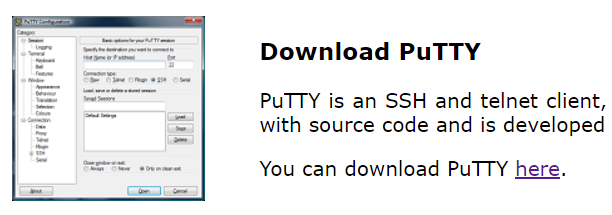
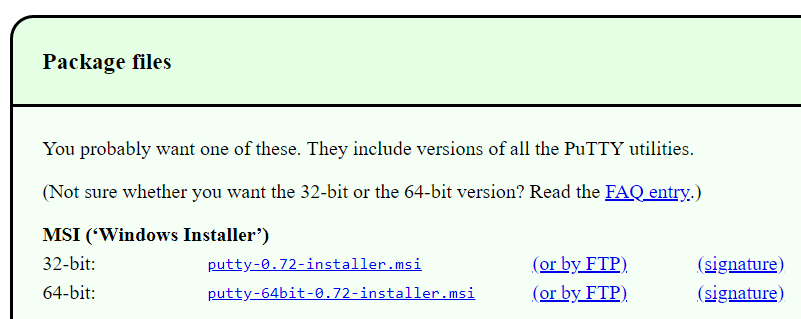
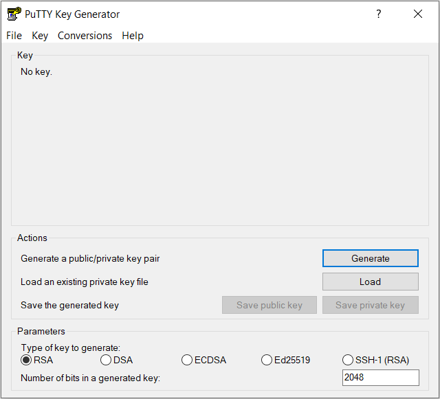
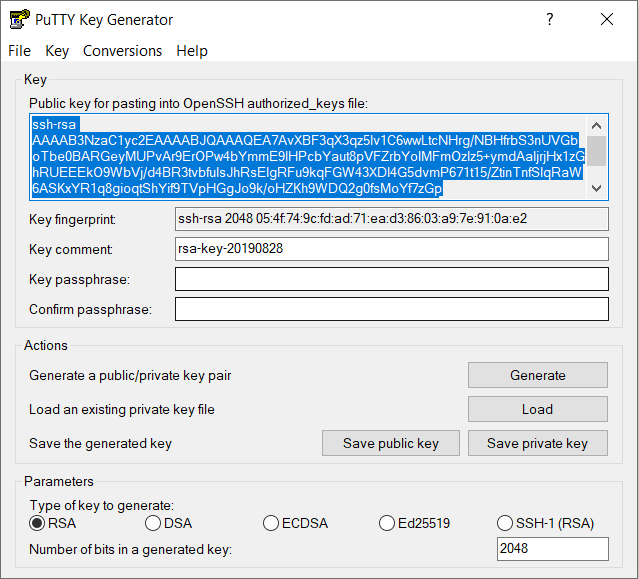
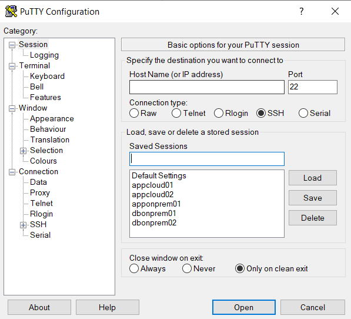
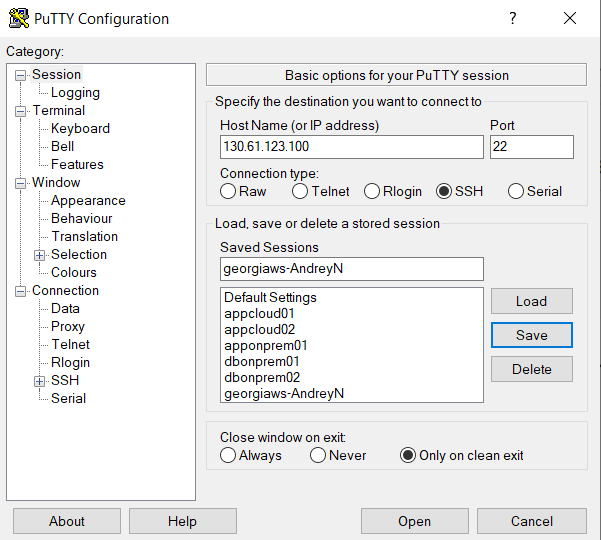
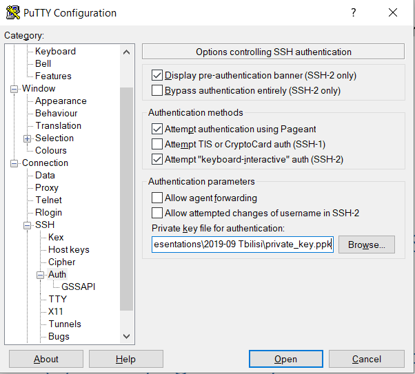
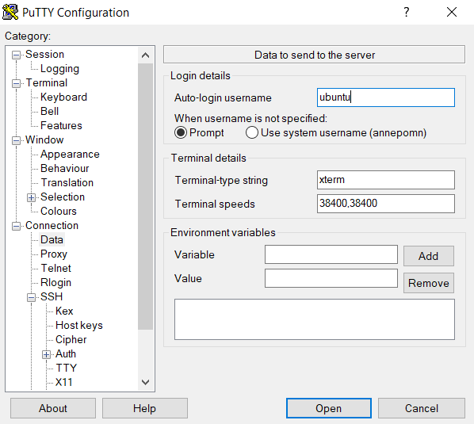
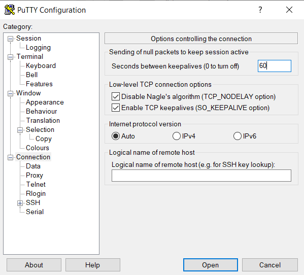
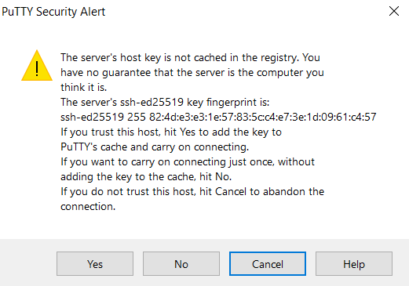

Создание ssh-ключа
------------------

Чтобы подключаться к виртуальным машинам, необходимо создать ключ ssh.

Ниже приведен пример, как это сделать при помощи бесплатной утилиты
**putty**.

1.  Откройте сайт <https://putty.org>

2.  Скачайте дистрибутив **putty**

3.  Установите **putty** на компьютер (необходимы права администратора
    для установки. Если их нет, то вы можете скачать исполняемые файлы
    exe **putty** и **puttygen в локальную папку**).

4.  Запустите **puttygen** и нажмите кнопку **Generate**.

5.  Следуйте инструкциям, чтобы сгенерировать ключ. Двигайте мышью
    некоторое время.

6.  Сохраните приватный ключ (для практикума вы можете не задавать
    пароль для ключа).

7.  Для доступа к виртуальным машинам публичный ключ находится в
    текстовом блоке в окне **puttygen**:

8.  Не закрывайте это окно, т.к. публичный ключ нам потребуется позже.

Подключение к виртуальной машине через ssh
------------------------------------------

1.  Запустите **Putty**.

2.  Введите Публичный IP-адрес вашей виртуальной машины и имя сохраняемой сессии (например, workshop) и нажмите кнопку **Save**:

3.  Перейдите в пункт **Connection / SSH / Auth** и откройте сохраненный
    ранее **Приватный** ключ, нажав кнопку Browse:

4.  Перейдите в пункт **Connection / Data** и введите в поле
    **Auto-login username**: **opc (для Oracle Linux)**

5.  Перейдите в пункт **Connection** и установите интервал keepalive в
    60 секунд, чтобы соединение не прерывалось по неактивности:

6.  Вернитесь в пункт **Session** и нажмите **Save** еще раз.

7.  Нажмите **Open**, чтобы подключиться к виртуальной машине.

8.  Вы увидите предупреждение (только в первый раз). Нажмите **Yes**.

